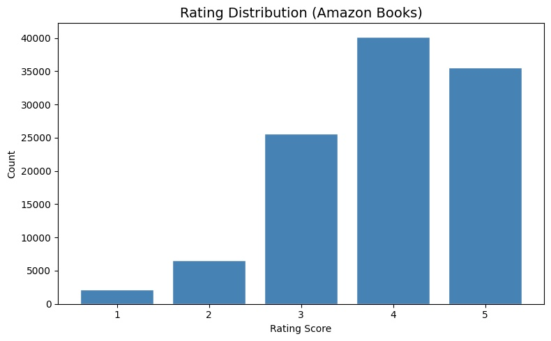
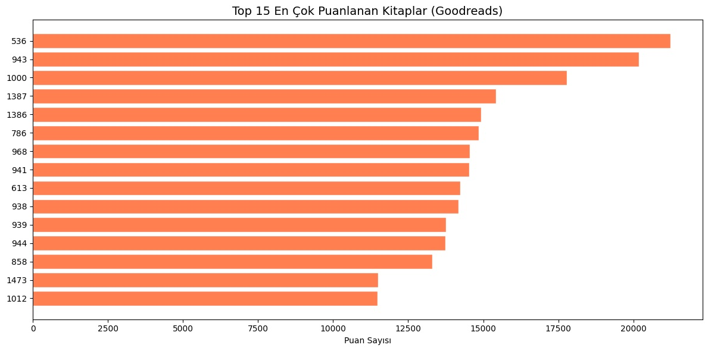
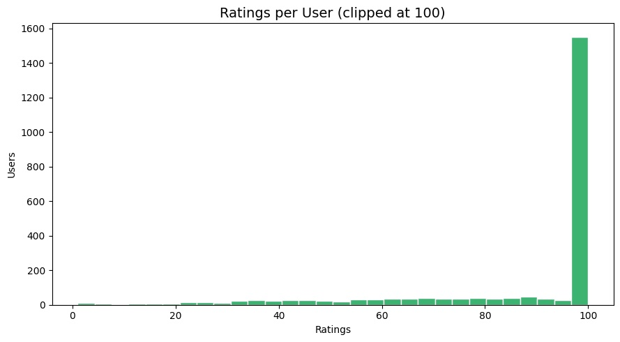
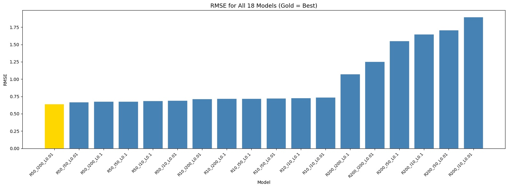
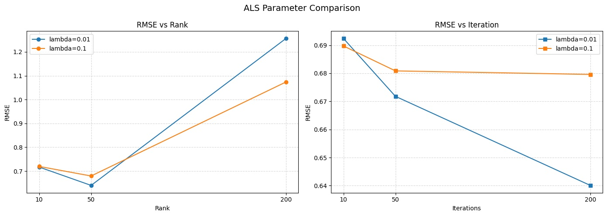

<div align="center">

# 📚 Book Recommendation System with Apache Spark

**Aydın Adnan Menderes University — CSE424 Big Data Analysis | 2026**


</div>

---


## 🔍 Overview

Large-scale book recommendation engine built with **Apache Spark ALS** (Alternating Least Squares) collaborative filtering on the Goodreads Book Reviews dataset — 11 million user-book interactions processed end-to-end on a distributed compute environment.

---

## 📦 Dataset

| Property | Value |
|---|---|
| Source | [Goodreads Book Reviews — Kaggle](https://www.kaggle.com/datasets/pypiahmad/goodreads-book-reviews1) |
| Size | 11,000,000 rows |
| Format | Apache Parquet (after ETL) |

**Schema:**
- `userId` — Unique user identifier *(IntegerType)*
- `bookId` — Unique book identifier *(IntegerType)*
- `rating` — Explicit score 1.0 – 5.0 *(FloatType)*

---

## ⚙️ System Environment

| Property | Value |
|---|---|
| Platform | Google Colab High-RAM |
| OS | Linux 6.6.122 x86_64 |
| RAM | 50.99 GB |
| CPU Cores | 12 |
| Storage | Google Drive via Fuse FS |

---

## 📊 Exploratory Data Analysis

### Rating Distribution


### Top 15 Most Rated Books


### Ratings per User


---

## 🤖 ALS Model Training

**18 models** trained across all combinations of:

| Parameter | Values |
|---|---|
| Rank | 10, 50, 200 |
| Max Iterations | 10, 50, 200 |
| Lambda (λ) | 0.01, 0.1 |

Train / Test split: **70% / 30%** — seed: `5031`

---

## 📈 Results

### RMSE for All 18 Models


### RMSE vs Rank & Iteration


### Full Ranking Table

| # | Rank | MaxIter | Lambda | RMSE | MSE |
|---|---|---|---|---|---|
| 🥇 1 | 50 | 200 | 0.01 | **0.6401** | **0.4097** |
| 2 | 50 | 50 | 0.01 | 0.6718 | 0.4513 |
| 3 | 50 | 200 | 0.1 | 0.6796 | 0.4618 |
| 4 | 50 | 50 | 0.1 | 0.6809 | 0.4636 |
| 5 | 50 | 10 | 0.1 | 0.6897 | 0.4757 |
| 6 | 10 | 200 | 0.1 | 0.7021 | 0.4930 |
| 7 | 10 | 50 | 0.1 | 0.7032 | 0.4945 |
| 8 | 10 | 10 | 0.1 | 0.7101 | 0.5043 |
| 9 | 10 | 200 | 0.01 | 0.7145 | 0.5106 |
| 10 | 10 | 50 | 0.01 | 0.7325 | 0.5365 |
| 11 | 10 | 10 | 0.01 | 0.7812 | 0.6103 |
| 12 | 50 | 10 | 0.01 | 0.7912 | 0.6261 |
| 13 | 200 | 200 | 0.1 | 1.0737 | 1.1529 |
| 14 | 200 | 200 | 0.01 | 1.2562 | 1.5780 |
| 15 | 200 | 50 | 0.1 | 1.3125 | 1.7225 |
| 16 | 200 | 50 | 0.01 | 1.4561 | 2.1203 |
| 17 | 200 | 10 | 0.1 | 1.6215 | 2.6291 |
| 18 | 200 | 10 | 0.01 | 1.8987 | 3.6050 |

### 🏆 Best Model

> **Rank = 50 | MaxIter = 200 | Lambda = 0.01**
> 
> RMSE: **0.640091** — predictions deviate ~0.64 on a 5-star scale
> 
> MSE: **0.409717**

### 💡 Key Findings

- **Rank = 50** is the sweet spot — enough latent dimensions without overfitting
- **Rank = 200** causes severe overfitting (RMSE up to **1.89**)
- **Lambda = 0.01** outperforms 0.1 at higher ranks with sufficient iterations
- More iterations consistently reduce RMSE for stable rank configurations

---

## 🚀 Usage

```bash
# 1. Open in Google Colab
# 2. Mount Google Drive
# 3. Run cells sequentially (Cell 2 → Cell 38)
# Dataset downloads automatically via kagglehub
pip install pyspark kagglehub
```

---

## 📁 Files

```
📦 repository
 ┣ 📓 notebook.ipynb       — Main project notebook
 ┣ 📄 notebook.html        — HTML export
 ┗ 📋 README.md            — This file
```

Dataset not included — download from [Kaggle](https://www.kaggle.com/datasets/pypiahmad/goodreads-book-reviews1)
